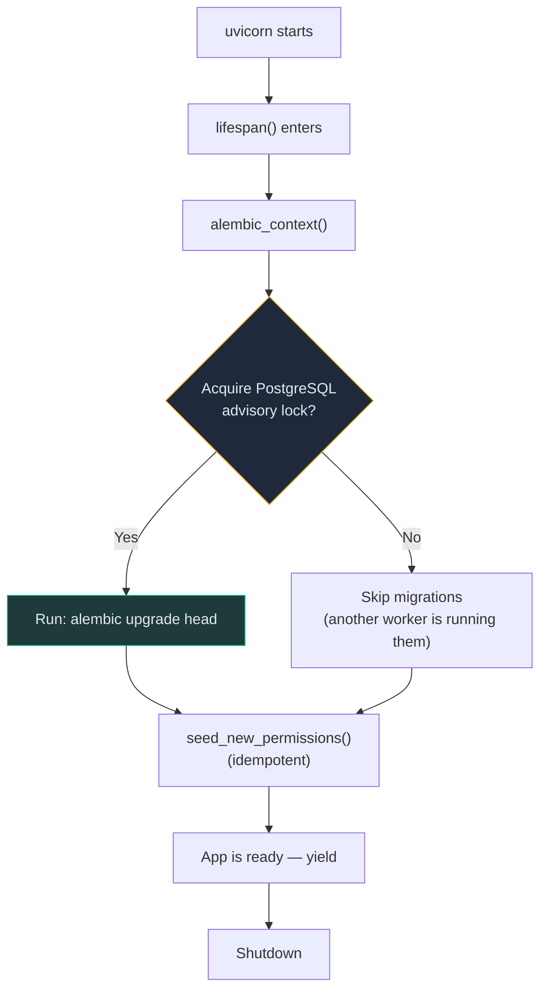
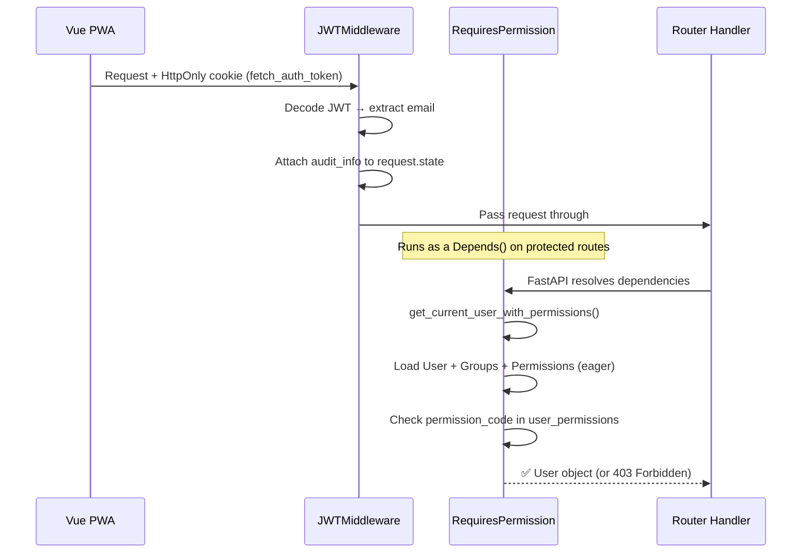

# API Development Guide

This guide covers the conventions, patterns, and architecture used in the FETCH2 FastAPI backend. Read this before writing any new endpoints, models, or schemas.

---

## Table of Contents

1. [Tech Stack](#1-tech-stack)
2. [Project Structure](#2-project-structure)
3. [Application Lifecycle](#3-application-lifecycle)
4. [Database Layer](#4-database-layer)
5. [Models](#5-models)
6. [Schemas](#6-schemas)
7. [Routers](#7-routers)
8. [Authentication & Authorization](#8-authentication--authorization)
9. [Pagination, Filtering & Sorting](#9-pagination-filtering--sorting)
10. [Error Handling](#10-error-handling)
11. [Audit Trail](#11-audit-trail)
12. [Background Tasks & Events](#12-background-tasks--events)
13. [Testing](#13-testing)
14. [Adding a New Feature (End-to-End)](#14-adding-a-new-feature-end-to-end)
15. [Configuration](#15-configuration)

---

## 1. Tech Stack

| Layer | Technology |
|---|---|
| Framework | FastAPI |
| ORM | SQLAlchemy 2.0 (Mapped columns) |
| Database | PostgreSQL |
| Migrations | Alembic (auto-run on startup) |
| Schemas | Pydantic v2 (`BaseModel`) |
| Pagination | `fastapi-pagination` |
| Auth | JWT (HttpOnly cookies) + SAML SSO |
| Settings | `pydantic-settings` + `.env` |
| Testing | Pytest + `TestClient` + Docker Compose |

---

## 2. Project Structure

```
inventory_service/
├── alembic/                      # Migration scripts
│   ├── versions/                 # Auto-generated migration files
│   └── env.py                    # Alembic environment config
├── alembic.ini                   # Alembic connection config
├── app/
│   ├── main.py                   # FastAPI app, lifespan, router registration
│   ├── middleware.py              # JWTMiddleware (auth + logging)
│   ├── auth/
│   │   └── dependencies.py       # get_current_user_with_permissions, RequiresPermission
│   ├── config/
│   │   ├── config.py             # Settings (pydantic-settings)
│   │   └── exceptions.py         # Custom exception classes + handlers
│   ├── database/
│   │   ├── base.py               # DeclarativeBase with auto __tablename__ + audit columns
│   │   └── session.py            # Engine, session factories, get_session DI, commit helpers
│   ├── models/                   # SQLAlchemy ORM models (one file per entity)
│   │   └── all.py                # Imports every model (ensures Base.metadata is populated)
│   ├── schemas/                  # Pydantic input/output schemas (one file per entity)
│   ├── routers/                  # API route handlers (one file per entity)
│   ├── services/                 # Business logic services
│   │   ├── audit_service.py      # Audit trail recording
│   │   └── shelving_assignment.py
│   ├── helpers/                  # Domain-specific helper functions
│   │   ├── owner_helpers.py
│   │   └── system_setting_helpers.py
│   ├── ils/                      # ILS integration (adapters, factory, tasks)
│   ├── saml/                     # SAML SSO configuration
│   ├── seed/                     # Data seeding scripts
│   ├── filter_params.py          # Reusable query parameter classes
│   ├── sorting.py                # BaseSorter + per-entity sort classes
│   ├── utilities.py              # Shared utility functions
│   ├── events.py                 # SQLAlchemy ORM event listeners
│   ├── logger.py                 # Logging configuration
│   └── tasks.py                  # ILS background task definitions
├── tests/
│   ├── conftest.py               # Pytest fixtures (DB, client, auth mock)
│   ├── fixtures/                 # Test data fixtures
│   ├── routes/                   # Route-level integration tests
│   └── domain/                   # Domain logic unit tests
└── requirements.txt
```

---

## 3. Application Lifecycle

The app startup sequence is defined in `main.py` via the `lifespan` context manager:



**Key details:**
- Migrations use a **PostgreSQL advisory lock** (`pg_try_advisory_lock(1)`) to prevent concurrent migration runs across replicas
- Permission seeding is **non-fatal** — if it fails, the app still starts
- All models are force-loaded via `app.models.all` before Alembic runs

### Middleware Stack (order matters)

```python
app.add_middleware(JWTMiddleware)     # 1st: Auth check + request logging
app.add_middleware(CORSMiddleware)    # 2nd: CORS headers
```

---

## 4. Database Layer

### Base Class (`database/base.py`)

All models inherit from a shared `Base` that provides:

```python
class Base(DeclarativeBase):
    @declared_attr
    def __tablename__(cls) -> str:
        return cls.__name__.lower() + "s"  # Building → buildings

    create_dt = Column(DateTime(timezone=True), default=func.now())
    update_dt = Column(DateTime(timezone=True), default=func.now(), onupdate=func.now())
```

- **Auto table naming**: Class name lowercased + "s"
- **Audit columns**: `create_dt` and `update_dt` are inherited by every model

### Session Management (`database/session.py`)

| Function | Usage | Context |
|---|---|---|
| `get_session()` | FastAPI `Depends()` DI | Route handlers (most common) |
| `session_manager()` | Context manager | Background tasks, scripts |
| `commit_record(session, record)` | Add + commit + refresh | Single record saves |
| `bulk_commit_records(session, records)` | Bulk save + commit | Batch operations |
| `remove_record(session, record)` | Delete + commit | Record deletion |

**Standard usage in a router:**

```python
from app.database.session import get_session

@router.get("/{id}")
def get_item(id: int, session: Session = Depends(get_session)):
    item = session.get(Item, id)
    if not item:
        raise NotFound(detail=f"Item ID {id} Not Found")
    return item
```

**In background tasks** (no request context):

```python
from app.database.session import session_manager

def my_background_task():
    with session_manager() as session:
        # ... do work ...
        session.commit()
```

### Audit Info Propagation

The `JWTMiddleware` decodes the JWT and attaches `audit_info` (user name + ID) to the request's middleware session. The `get_session()` DI function transfers this to the route's session so that audit trail events can record who made the change.

---

## 5. Models

### Convention

Each model lives in its own file under `app/models/` and **must** be imported in `app/models/all.py` for Alembic to detect it.

### Pattern

```python
# app/models/buildings.py
from app.database.base import Base
from sqlalchemy.orm import Mapped, mapped_column, relationship
from sqlalchemy import SmallInteger, String
from typing import Optional, List

class Building(Base):
    # Primary key
    id: Mapped[int] = mapped_column(SmallInteger, primary_key=True, autoincrement=True)

    # Fields
    name: Mapped[Optional[str]] = mapped_column(String(25), nullable=True, default=None)

    # Relationships
    modules: Mapped[List["Module"]] = relationship(
        back_populates="building",
        cascade="all, delete-orphan"
    )
```

### Rules

- **DO**: Use `Mapped[type]` + `mapped_column()` (SQLAlchemy 2.0 style)
- **DO**: Define both sides of relationships with `back_populates`
- **DO**: Add cascade rules (`"all, delete-orphan"` for parent-owned children)
- **DO**: Import new models in `app/models/all.py`
- **DON'T**: Define `__tablename__` — it's auto-generated by `Base`
- **DON'T**: Define `create_dt` / `update_dt` — they're inherited from `Base`

### Enums

Status fields use Python `Enum` classes defined within the model file:

```python
import enum

class ItemStatus(str, enum.Enum):
    In = "In"
    Out = "Out"
    Requested = "Requested"
    PickList = "PickList"
    Withdrawn = "Withdrawn"
```

---

## 6. Schemas

### Convention

Each entity has a schema file under `app/schemas/` with multiple Pydantic models for different operations.

### Naming Pattern

| Schema Class | Purpose | Used In |
|---|---|---|
| `BuildingInput` | Create request body | `POST /buildings` |
| `BuildingUpdateInput` | Partial update body | `PATCH /buildings/{id}` |
| `BuildingListOutput` | List item (summary) | `GET /buildings` |
| `BuildingDetailReadOutput` | Full detail with relationships | `GET /buildings/{id}` |
| `BuildingDetailWriteOutput` | Response after create/update | `POST` / `PATCH` response |

### Pattern

```python
from pydantic import BaseModel, constr, ConfigDict
from typing import Optional, List
from datetime import datetime

# --- Input schemas ---

class BuildingInput(BaseModel):
    name: constr(max_length=25, strict=False) = None

    model_config = ConfigDict(
        json_schema_extra={
            "example": { "name": "Southpoint Circle" }
        }
    )

class BuildingUpdateInput(BaseModel):
    name: Optional[constr(max_length=25, strict=False)] = None

# --- Output schemas ---

class BuildingBaseOutput(BaseModel):
    id: int
    name: str | None
    create_dt: datetime
    update_dt: datetime

class BuildingListOutput(BuildingBaseOutput):
    pass  # Same fields as base

class BuildingDetailReadOutput(BuildingBaseOutput):
    modules: List[ModuleNestedForBuilding]  # Nested relationship data
```

### Rules

- **DO**: Use `model_dump(exclude_unset=True)` for PATCH operations (only apply fields the client sent)
- **DO**: Add `json_schema_extra` with examples for auto-generated API docs
- **DO**: Create nested output schemas for relationships (e.g., `ModuleNestedForBuilding`)
- **DON'T**: Return the SQLAlchemy model directly — always use a Pydantic output schema

---

## 7. Routers

### Convention

Each entity has a router file under `app/routers/`. Every router must be imported and registered in `main.py`.

### Pattern (Full CRUD)

```python
from fastapi import APIRouter, Depends, Query
from fastapi.responses import Response
from fastapi_pagination import Page
from fastapi_pagination.ext.sqlalchemy import paginate
from sqlalchemy.orm import Session
from sqlalchemy import select

from app.database.session import get_session
from app.auth.dependencies import RequiresPermission
from app.filter_params import SortParams
from app.sorting import BaseSorter
from app.config.exceptions import NotFound, ValidationException, InternalServerError

router = APIRouter(
    prefix="/buildings",
    tags=["buildings"],
    dependencies=[Depends(RequiresPermission("can_manage_locations"))],
)

# LIST (paginated)
@router.get("/", response_model=Page[BuildingListOutput])
def get_building_list(
    session: Session = Depends(get_session),
    sort_params: SortParams = Depends(),
    search: Optional[str] = Query(None),
):
    query = select(Building)
    if search:
        query = query.where(Building.name.icontains(search))
    if sort_params.sort_by:
        sorter = BaseSorter(Building)
        query = sorter.apply_sorting(query, sort_params)
    return paginate(session, query)

# DETAIL
@router.get("/{id}", response_model=BuildingDetailReadOutput)
def get_building_detail(id: int, session: Session = Depends(get_session)):
    building = session.get(Building, id)
    if not building:
        raise NotFound(detail=f"Building ID {id} Not Found")
    return building

# CREATE
@router.post("/", response_model=BuildingDetailWriteOutput, status_code=201)
def create_building(input: BuildingInput, session: Session = Depends(get_session)):
    new_building = Building(**input.model_dump())
    session.add(new_building)
    session.commit()
    session.refresh(new_building)
    return new_building

# UPDATE
@router.patch("/{id}", response_model=BuildingDetailWriteOutput)
def update_building(id: int, input: BuildingUpdateInput, session: Session = Depends(get_session)):
    existing = session.get(Building, id)
    if not existing:
        raise NotFound(detail=f"Building ID {id} Not Found")
    for key, value in input.model_dump(exclude_unset=True).items():
        setattr(existing, key, value)
    setattr(existing, "update_dt", datetime.now(timezone.utc))
    session.add(existing)
    session.commit()
    session.refresh(existing)
    return existing

# DELETE
@router.delete("/{id}")
def delete_building(id: int, session: Session = Depends(get_session)):
    building = session.get(Building, id)
    if not building:
        raise NotFound(detail=f"Building ID {id} Not Found")
    # Check for dependent data before deleting
    session.delete(building)
    session.commit()
    return Response(status_code=204)
```

### Registering in `main.py`

```python
# 1. Import the router
from app.routers import my_new_entity

# 2. Register it (order matters — nested routes before base routes)
app.include_router(my_new_entity.router)
```

---

## 8. Authentication & Authorization

### Flow



### `RequiresPermission` — Route-Level Guard

Apply to an entire router:

```python
router = APIRouter(
    prefix="/buildings",
    dependencies=[Depends(RequiresPermission("can_manage_locations"))],
)
```

Or to a single endpoint:

```python
@router.post("/", dependencies=[Depends(RequiresPermission("can_create_building"))])
def create_building(...):
```

### Token Sources (Priority Order)

1. **HttpOnly cookie**: `fetch_auth_token` (production — set by SAML login)
2. **Authorization header**: `Bearer <token>` (fallback for API testing)

### Environment Bypass

In `debug`, `local`, `develop`, and `test` environments, the middleware allows requests without valid tokens to pass through (for development convenience).

---

## 9. Pagination, Filtering & Sorting

### Pagination

All list endpoints use `fastapi-pagination` and return a `Page[Schema]` wrapper:

```python
from fastapi_pagination import Page
from fastapi_pagination.ext.sqlalchemy import paginate

@router.get("/", response_model=Page[ItemListOutput])
def get_items(session: Session = Depends(get_session)):
    query = select(Item)
    return paginate(session, query)
```

**Response shape:**

```json
{
  "items": [...],
  "total": 150,
  "page": 1,
  "size": 50,
  "pages": 3
}
```

### Filter Parameters

Reusable filter classes are defined in `filter_params.py` and injected via `Depends()`:

```python
class JobFilterParams:
    def __init__(
        self,
        status: List[str] = Query(default=None),
        building_name: List[str] = Query(default=None),
        assigned_user: List[str] = Query(default=None),
        from_dt: Optional[datetime] = None,
        to_dt: Optional[datetime] = None,
    ):
        self.status = status
        self.building_name = building_name
        # ...
```

**Usage:**

```python
@router.get("/", response_model=Page[JobListOutput])
def get_jobs(
    session: Session = Depends(get_session),
    filters: JobFilterParams = Depends(),
):
    query = select(Job)
    if filters.status:
        query = query.where(Job.status.in_(filters.status))
    if filters.from_dt:
        query = query.where(Job.create_dt >= filters.from_dt)
    return paginate(session, query)
```

### Sorting

Sort parameters are captured by `SortParams` and applied via `BaseSorter`:

```python
class SortParams(BaseModel):
    sort_by: Optional[str] = Query(default=None)
    sort_order: Optional[str] = Query(default="asc")  # "asc" or "desc"
```

`BaseSorter` handles simple column sorts. For complex sorts (joins, computed columns), create a subclass:

```python
class ShelvingJobSorter(BaseSorter):
    def custom_sort(self, query, sort_params, order_func):
        if sort_params.sort_by == "container_count":
            # Complex subquery join...
            return query.order_by(order_func(count_column))
        return super().custom_sort(query, sort_params, order_func)
```

---

## 10. Error Handling

### Custom Exceptions (`config/exceptions.py`)

| Exception | Status Code | When to Use |
|---|---|---|
| `BadRequest` | 400 | Invalid request data |
| `NotAuthorized` | 401 | Missing/invalid authentication |
| `Forbidden` | 403 | Missing permission |
| `NotFound` | 404 | Entity not found by ID |
| `ValidationException` | 422 | Business rule violation, `IntegrityError` |
| `InternalServerError` | 500 | Unexpected failures |

**Usage:**

```python
from app.config.exceptions import NotFound, ValidationException

def get_item(id: int, session: Session = Depends(get_session)):
    item = session.get(Item, id)
    if not item:
        raise NotFound(detail=f"Item ID {id} Not Found")
    return item
```

### Exception Handlers

All exceptions are caught by handlers registered in `main.py`. The `500` and unhandled exception handlers:
- Log the full traceback via `inventory_logger`
- Return a sanitized error message to the client
- Manually attach CORS headers (because errors may occur before CORS middleware)

---

## 11. Audit Trail

### How It Works

1. The `JWTMiddleware` decodes the JWT and creates `audit_info = { "name": email, "id": user_id }`
2. This is attached to `request.state.db_session`
3. `get_session()` transfers it to the route's session via `start_session_with_audit_info()`
4. PostgreSQL triggers (or explicit calls to `audit_service.py`) use this info to record who changed what

### Recording Audit Events

```python
from app.services.audit_service import log_audit_event

# Inside a route handler:
log_audit_event(
    session=session,
    action="UPDATE",
    entity_type="Item",
    entity_id=item.id,
    details=f"Status changed from {old_status} to {new_status}"
)
```

---

## 12. Background Tasks & Events

### FastAPI Background Tasks

Long-running operations (e.g., ILS sync) are dispatched as background tasks:

```python
from fastapi import BackgroundTasks

@router.post("/{id}/complete")
def complete_job(id: int, background_tasks: BackgroundTasks, session: Session = Depends(get_session)):
    job = session.get(Job, id)
    job.status = "Complete"
    session.commit()

    # Fire-and-forget ILS sync
    background_tasks.add_task(trigger_ils_checkin, job_id=id)
    return job
```

### SQLAlchemy ORM Events (`events.py`)

ORM-level listeners fire automatically on insert/update. Used for:
- **Shelving discrepancy detection**: When a Tray or NonTrayItem is inserted with a `shelving_job_id`, the system checks for location, owner, and size class mismatches
- **Shelf space tracking**: `update_shelf_space_after_tray()` and `update_shelf_space_after_non_tray()` adjust `Shelf.available_space` via delta math (`+1` / `-1`) within the same transaction

```python
@event.listens_for(Tray, "after_insert")
def check_for_tray_shelving_discrepancy(mapper, connection, target):
    with Session(bind=connection) as session:
        # Check for location/owner/size discrepancies
        # Create ShelvingJobDiscrepancy records if found
```

---

## 13. Testing

### Setup

Tests use a **Dockerized PostgreSQL** container spun up via `test-docker-compose.yml`:

```
tests/
├── conftest.py                    # Fixtures: DB init, session, client, auth mock
├── fixtures/
│   └── configtest.py              # Test data loaders + helpers
├── routes/                        # Integration tests (HTTP-level)
└── domain/                        # Unit tests (business logic)
```

### Key Fixtures

| Fixture | Scope | Purpose |
|---|---|---|
| `init_db` | session | Starts Docker Postgres, tears it down after all tests |
| `session` | session | SQLAlchemy session bound to test DB |
| `client` | session | `TestClient` with `get_session` and auth overridden |
| `test_database` | session | Runs Alembic migrations + seeds fake data |

### Auth Mock

Tests bypass real authentication by overriding `get_current_user_with_permissions`:

```python
class MockSuperUser:
    id = 999
    first_name = "GlobalMock"
    last_name = "User"

    @property
    def groups(self):
        class MockPerm:
            def __init__(self, name): self.name = name
        class MockGroup:
            permissions = [MockPerm("can_access_users"), MockPerm("can_manage_locations"), ...]
        return [MockGroup()]

app.dependency_overrides[get_current_user_with_permissions] = lambda: MockSuperUser()
```

### Running Tests

```bash
cd inventory_service
pytest tests/ -v
```

---

## 14. Adding a New Feature (End-to-End)

Here's the complete recipe for adding a new entity (e.g., "Audit Log"):

### Step 1: Create the Model

```python
# app/models/audit_logs.py
from app.database.base import Base
from sqlalchemy.orm import Mapped, mapped_column, relationship
from sqlalchemy import Integer, String, Text

class AuditLog(Base):
    id: Mapped[int] = mapped_column(Integer, primary_key=True, autoincrement=True)
    action: Mapped[str] = mapped_column(String(50))
    entity_type: Mapped[str] = mapped_column(String(100))
    entity_id: Mapped[int] = mapped_column(Integer)
    details: Mapped[str | None] = mapped_column(Text, nullable=True)
```

### Step 2: Register the Model

```python
# app/models/all.py — add this line:
from app.models.audit_logs import AuditLog
```

### Step 3: Generate the Migration

```bash
cd inventory_service
alembic revision --autogenerate -m "add audit_logs table"
```

Review the generated migration in `alembic/versions/`, then apply:

```bash
alembic upgrade head
```

### Step 4: Create Schemas

```python
# app/schemas/audit_logs.py
from pydantic import BaseModel
from datetime import datetime
from typing import Optional

class AuditLogInput(BaseModel):
    action: str
    entity_type: str
    entity_id: int
    details: Optional[str] = None

class AuditLogOutput(BaseModel):
    id: int
    action: str
    entity_type: str
    entity_id: int
    details: str | None
    create_dt: datetime
    update_dt: datetime
```

### Step 5: Create the Router

```python
# app/routers/audit_logs.py
from fastapi import APIRouter, Depends
from fastapi_pagination import Page
from fastapi_pagination.ext.sqlalchemy import paginate
from sqlalchemy.orm import Session
from sqlalchemy import select

from app.database.session import get_session
from app.auth.dependencies import RequiresPermission
from app.models.audit_logs import AuditLog
from app.schemas.audit_logs import AuditLogOutput

router = APIRouter(
    prefix="/audit-logs",
    tags=["audit-logs"],
    dependencies=[Depends(RequiresPermission("can_access_admin"))],
)

@router.get("/", response_model=Page[AuditLogOutput])
def get_audit_logs(session: Session = Depends(get_session)):
    query = select(AuditLog).order_by(AuditLog.create_dt.desc())
    return paginate(session, query)
```

### Step 6: Register the Router

```python
# app/main.py — add two lines:

# 1. Import
from app.routers import audit_logs

# 2. Register
app.include_router(audit_logs.router)
```

### Step 7: Add Frontend Endpoint

```javascript
// vue/src/http/InventoryService.js
auditLogs: '/audit-logs/',
```

---

## 15. Configuration

### Environment Variables (`config/config.py`)

| Variable | Purpose | Default |
|---|---|---|
| `APP_NAME` | Application name | `"FETCH"` |
| `APP_ENVIRONMENT` | Runtime environment | `"local"` |
| `SECRET_KEY` | JWT signing key | **Required** (no default) |
| `DATABASE_URL` | PostgreSQL connection string | Docker default |
| `MIGRATION_URL` | Alembic migration connection | Localhost default |
| `VUE_HOST` | Frontend origin for CORS | `"https://localhost:8000"` |
| `ALLOWED_ORIGINS` | Comma-separated CORS origins | Localhost defaults |
| `ALLOWED_ORIGINS_REGEX` | Regex CORS patterns | Example domain pattern |
| `ENABLE_ORM_SQL_LOGGING` | Log all SQL queries | `False` |
| `TIMEZONE` | Application timezone | `"America/New_York"` |
| `IDP_ENTITY_ID` | SAML IdP entity ID | Example URL |
| `IDP_LOGIN_URL` | SAML IdP login URL | Example URL |

Settings are loaded via `pydantic-settings` with `.env` file support and cached with `@lru_cache`.

---

## File Reference

| File | Purpose |
|---|---|
| [`main.py`](inventory_service/app/main.py) | App factory, lifespan, middleware, router registration |
| [`middleware.py`](inventory_service/app/middleware.py) | JWT auth middleware + request logging |
| [`dependencies.py`](inventory_service/app/auth/dependencies.py) | `get_current_user_with_permissions`, `RequiresPermission` |
| [`base.py`](inventory_service/app/database/base.py) | `DeclarativeBase` with auto-tablename + audit columns |
| [`session.py`](inventory_service/app/database/session.py) | Engine, session factories, `get_session` DI |
| [`config.py`](inventory_service/app/config/config.py) | `Settings` class (pydantic-settings) |
| [`exceptions.py`](inventory_service/app/config/exceptions.py) | Custom exceptions + handlers |
| [`filter_params.py`](inventory_service/app/filter_params.py) | Reusable query parameter classes |
| [`sorting.py`](inventory_service/app/sorting.py) | `BaseSorter` + entity-specific sorter subclasses |
| [`utilities.py`](inventory_service/app/utilities.py) | Shared helper functions (location lookup, container assignment) |
| [`events.py`](inventory_service/app/events.py) | SQLAlchemy ORM event listeners (discrepancy checks, shelf space) |
| [`tasks.py`](inventory_service/app/tasks.py) | ILS background task definitions |
| [`all.py`](inventory_service/app/models/all.py) | Model registry (imports all models for Alembic) |
| [`conftest.py`](inventory_service/tests/conftest.py) | Pytest fixtures (Docker DB, TestClient, auth mock) |
