# FETCH2 Architecture

This document provides a comprehensive visual reference for the FETCH2 platform architecture. All diagrams are rendered using [Mermaid](https://mermaid.js.org/) and will display natively on GitHub, GitLab, and in VS Code with the Mermaid extension.

---

## Table of Contents

1. [High-Level System Overview](#1-high-level-system-overview)
2. [SAML SSO Authentication Flow](#2-saml-sso-authentication-flow)
3. [Backend API Architecture](#3-backend-api-architecture)
4. [Frontend Architecture](#4-frontend-architecture)
5. [Data Model](#5-data-model)

---

## 1. High-Level System Overview

The production deployment consists of three core services behind a load balancer, with two external integrations (Identity Provider for SSO and FOLIO for ILS operations).

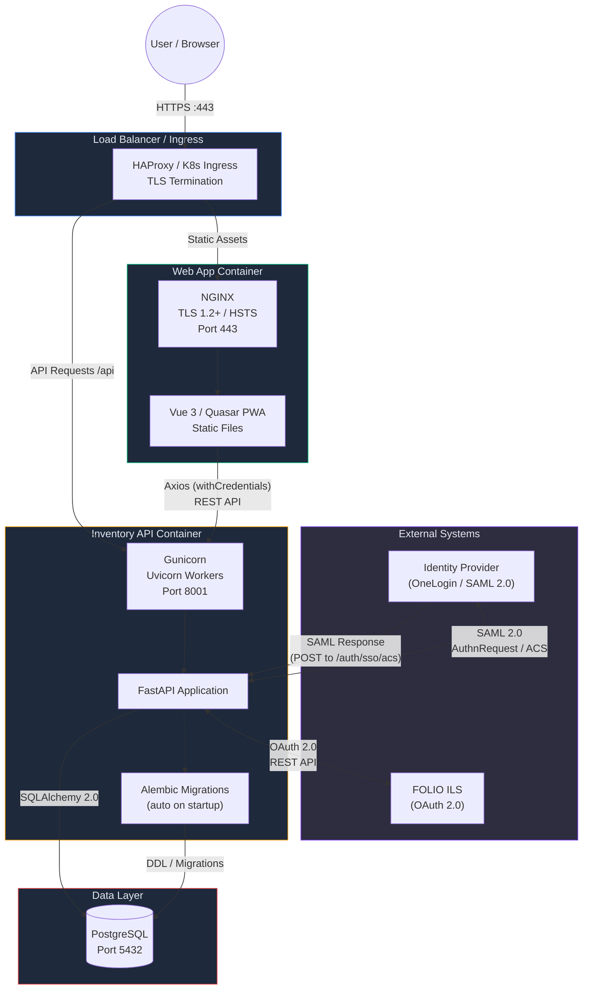

| Service | Technology | Port | Source |
|---|---|---|---|
| **Web App** | Vue 3 / Quasar PWA → NGINX | 443 (TLS) | `fetch-vue/` |
| **Inventory API** | Python FastAPI → Gunicorn/Uvicorn | 8001 | `fetch-inventory_service/` |
| **PostgreSQL** | PostgreSQL 14+ | 5432 | `fetch-database/` |
| **Identity Provider** | SAML 2.0 (OneLogin) | External | Configured in `app/saml/config/` |
| **FOLIO ILS** | OAuth 2.0 REST API | External | `app/ils/folio_adapter.py` |

---

## 2. SAML SSO Authentication Flow

This sequence diagram traces the complete login lifecycle, from an unauthenticated browser request through SAML negotiation, JWT issuance, and session management.

```mermaid
sequenceDiagram
    autonumber
    participant B as Browser
    participant VUE as Vue Frontend<br/>(Pinia userStore)
    participant NGINX as NGINX
    participant API as FastAPI<br/>(auth router)
    participant MW as JWTMiddleware
    participant DB as PostgreSQL
    participant IDP as Identity Provider<br/>(OneLogin)

    Note over B,IDP: SSO Login Flow (Production)

    B->>NGINX: GET https://fetch.example.com/
    NGINX->>B: Serve Vue PWA (static files)
    B->>VUE: App mounts, checks localStorage
    VUE->>API: GET /auth/me (no cookie)
    API-->>VUE: 401 Unauthorized

    Note over VUE,API: Redirect to SSO

    VUE->>API: GET /auth/sso/login?preserve_route=/shelving
    API->>API: load_saml_settings() per APP_ENVIRONMENT
    API->>API: Build SAML AuthnRequest
    API-->>B: 302 Redirect to IdP login URL

    B->>IDP: User authenticates (credentials / MFA)
    IDP->>IDP: Validate user, fetch-build SAML Assertion
    IDP->>API: POST /auth/sso/acs (SAML Response + RelayState)

    Note over API,DB: Process SAML Response

    API->>API: process_response(), validate assertion
    API->>API: Extract email, first_name, last_name from claims
    API->>DB: SELECT user WHERE email = ?
    alt User exists
        DB-->>API: User record
    else New user
        API->>DB: INSERT new User
        DB-->>API: Created user record
    end

    API->>API: generate_token() → JWT (HS256, 15min exp)
    API->>DB: UPDATE user.fetch_auth_token, fetch_auth_expiration
    API-->>B: 303 Redirect to VUE_HOST/{RelayState}<br/>Set-Cookie: fetch_auth_token (HttpOnly, Secure, SameSite=Lax)

    Note over B,MW: Authenticated Session

    B->>VUE: App loads at /shelving
    VUE->>API: GET /auth/me (cookie auto-attached)
    MW->>MW: Extract token from cookie
    MW->>MW: jwt.decode() → validate signature + expiry
    MW->>DB: Verify user.fetch_auth_expiration
    MW->>DB: Refresh expiration (sliding window +15min)
    MW->>API: Attach audit_info to request.state
    API-->>VUE: 200 { user_id, email, permissions[] }
    VUE->>VUE: Hydrate userStore, save to localStorage

    Note over B,MW: Subsequent API Requests

    VUE->>API: GET /items/?page=1 (cookie auto-attached)
    MW->>MW: Validate JWT, refresh sliding window
    MW-->>B: Re-issue cookie with refreshed JWT
    API-->>VUE: 200 { items[] }

    Note over B,API: Legacy Login (Non-Production Only)

    rect rgb(60, 60, 80)
        B->>VUE: Submit email via login form
        VUE->>API: POST /auth/legacy/login { email }
        API->>DB: SELECT user WHERE email = ?
        API->>API: generate_token() → JWT
        API-->>VUE: 200 + Set-Cookie: fetch_auth_token
        VUE->>API: GET /auth/me
        API-->>VUE: 200 { user profile + permissions }
    end
```

### Key Security Features

- **HttpOnly Cookies**: The JWT is never exposed to JavaScript — immune to XSS token theft
- **Sliding Window**: Each successful request refreshes the 15-minute expiration (NIST IA-11)
- **Dual Token Validation**: Both JWT signature AND fetch-database `fetch_auth_expiration` must be valid
- **Environment Gating**: Legacy login is disabled when `APP_ENVIRONMENT=production`
- **Sanitized Logging**: Authorization headers, cookies, and sensitive query params are redacted from logs (NIST AU-9)

---

## 3. Backend API Architecture

The FastAPI application is organized into distinct layers. Every request flows through middleware → router → business logic → fetch-database.

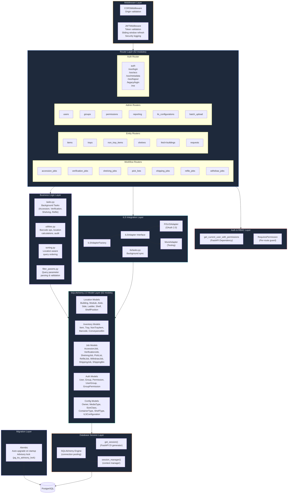

---

## 4. Frontend Architecture

The Vue 3 / Quasar PWA is organized into pages, components, Pinia stores, and a centralized HTTP client. The Vue Router enforces permission-based access control on every route.

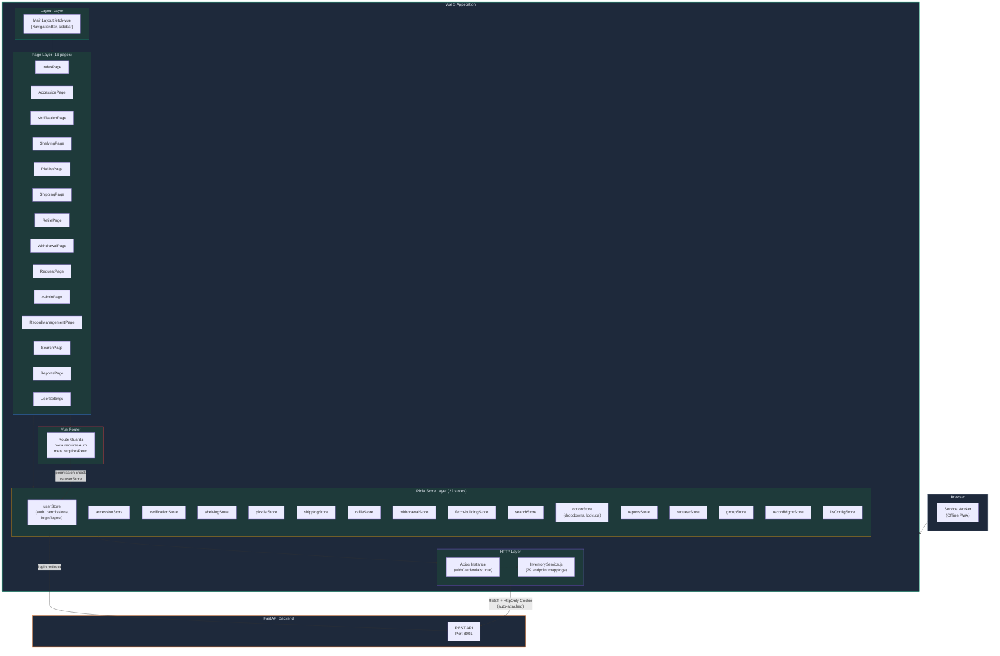

### Frontend → Backend Endpoint Map

The `InventoryService.js` file defines 79 endpoint constants used by all Pinia stores. Key categories:

| Category | Endpoints | Example |
|---|---|---|
| **Auth** | `authSsoLogin`, `authSsoLogout`, `authLegacyLogin` | `/auth/sso/login/` |
| **Workflow Jobs** | `accessionJobs`, `verificationJobs`, `shelvingJobs`, `pickLists`, `shippingJobs`, `refileJobs`, `withdrawJobs` | `/accession-jobs/workflow/` |
| **Inventory** | `items`, `trays`, `nonTrayItems`, `shelves` | `/items/barcode/` |
| **Admin** | `users`, `groups`, `permissions`, `fetch-buildings` | `/groups/` |
| **Reporting** | 12 reporting endpoints | `/reporting/open-locations/` |
| **ILS** | `ilsConfigurations`, `ilsSyncErrors` | `/ils-configurations/` |

---

## 5. Data Model

The FETCH2 fetch-database contains 62+ tables. To keep the ER diagram readable, the model is organized into **five domain groups**, each shown as a separate diagram. Cross-domain foreign keys are noted in the relationship labels.

### 5a. Location Hierarchy

The physical facility is modeled as a strict tree: **Building → Module → Aisle → Side → Ladder → Shelf → ShelfPosition**. Each level enforces uniqueness within its parent.

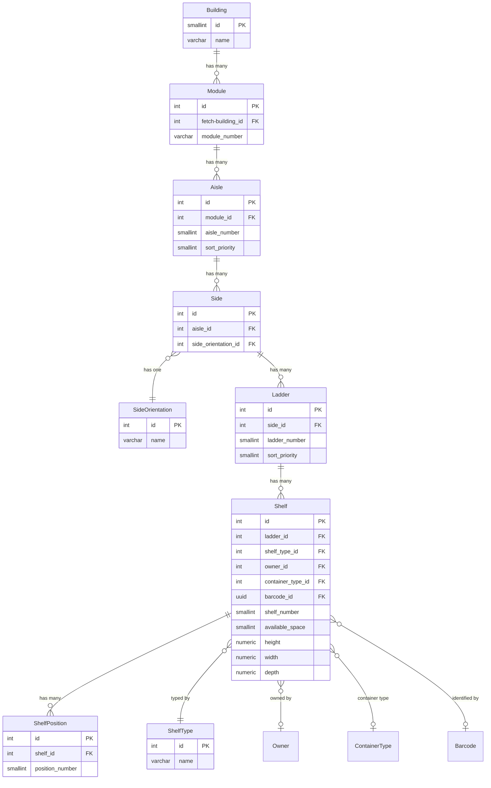

### 5b. Inventory Objects

Items live in Trays (which occupy ShelfPositions). Non-Tray Items occupy ShelfPositions directly. All three entities are identified by Barcodes and classified by Owner, SizeClass, MediaType, and ContainerType.

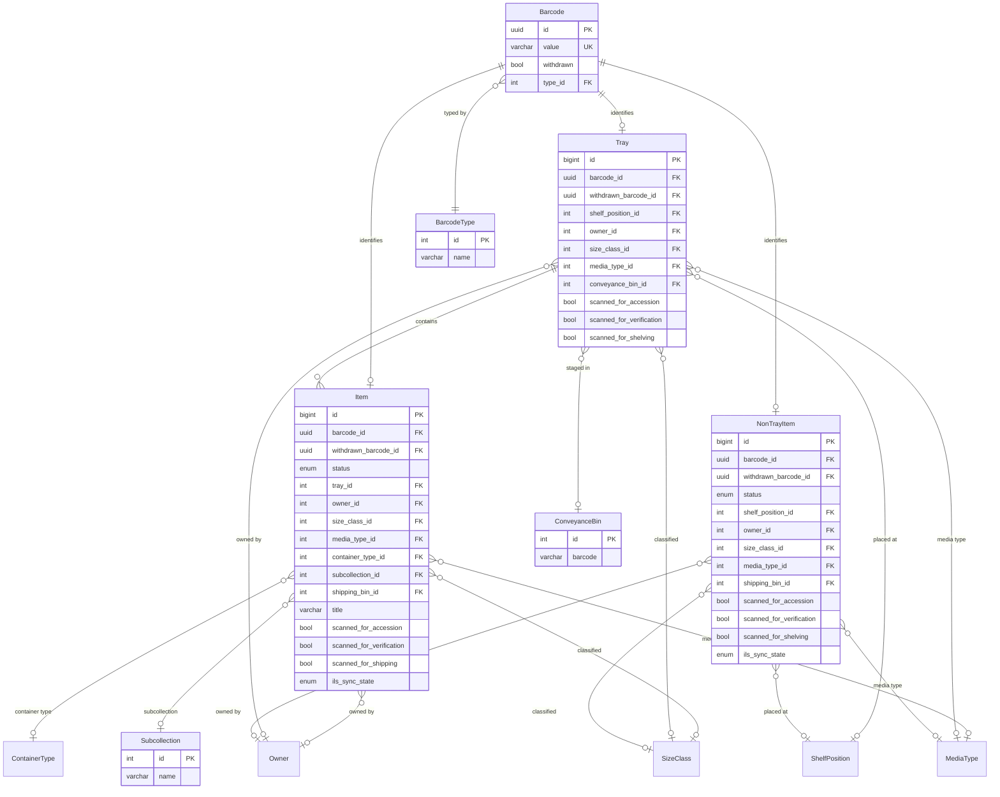

### 5c. Workflow Jobs

The seven core workflows each have a Job model. Jobs are assigned to Users and track status, run time, and transitions. Many-to-many link tables connect Items/Trays to Refile and Withdraw jobs.

```mermaid
erDiagram
    User ||--o{ AccessionJob : "assigned to"
    User ||--o{ VerificationJob : "assigned to"
    User ||--o{ ShelvingJob : "assigned to"
    User ||--o{ PickList : "assigned to"
    User ||--o{ ShippingJob : "assigned to"
    User ||--o{ RefileJob : "assigned to"
    User ||--o{ WithdrawJob : "assigned to"

    AccessionJob ||--o{ Tray : "accessions"
    AccessionJob ||--o{ Item : "accessions"
    AccessionJob ||--o{ NonTrayItem : "accessions"
    AccessionJob ||--o{ VerificationJob : "creates"
    AccessionJob }o--|| Workflow : "uses workflow"

    VerificationJob ||--o{ Tray : "verifies"
    VerificationJob ||--o{ Item : "verifies"
    VerificationJob ||--o{ NonTrayItem : "verifies"

    ShelvingJob ||--o{ Tray : "shelves"
    ShelvingJob ||--o{ NonTrayItem : "shelves"
    ShelvingJob }o--|| Building : "in fetch-building"
    ShelvingJob ||--o{ ShelvingJobContainer : "contains"
    ShelvingJob ||--o{ ShelvingJobDiscrepancy : "logs"

    Request }o--o| Item : "requests"
    Request }o--o| NonTrayItem : "requests"
    Request }o--o| PickList : "grouped into"

    PickList ||--o{ Request : "fulfills"
    PickList }o--o| Building : "in fetch-building"
    PickList ||--o{ WithdrawJob : "triggers"

    ShippingJob ||--o{ ShippingBin : "contains"
    ShippingBin ||--o{ Item : "ships"
    ShippingBin ||--o{ NonTrayItem : "ships"
    ShippingBin }o--o| DeliveryLocation : "delivers to"

    RefileJob }o--o{ Item : "refiles (M2M)"
    RefileJob }o--o{ NonTrayItem : "refiles (M2M)"

    WithdrawJob }o--o{ Item : "withdraws (M2M)"
    WithdrawJob }o--o{ NonTrayItem : "withdraws (M2M)"
    WithdrawJob }o--o{ Tray : "withdraws (M2M)"

    AccessionJob {
        bigint id PK
        int workflow_id FK
        int assigned_user_id FK
        int created_by_id FK
        int owner_id FK
        int media_type_id FK
        int size_class_id FK
        int container_type_id FK
        bool trayed
        enum status
        interval run_time
    }
    VerificationJob {
        bigint id PK
        int accession_job_id FK
        int assigned_user_id FK
        int created_by_id FK
        enum status
        interval run_time
    }
    ShelvingJob {
        int id PK
        int fetch-building_id FK
        int assigned_user_id FK
        int created_by_id FK
        enum status
        enum origin
        enum mode
        interval run_time
    }
    PickList {
        bigint id PK
        int fetch-building_id FK
        int assigned_user_id FK
        int created_by_id FK
        enum status
        interval run_time
    }
    ShippingJob {
        bigint id PK
        int assigned_user_id FK
        int created_by_id FK
        enum status
        interval run_time
    }
    ShippingBin {
        bigint id PK
        int shipping_job_id FK
        int delivery_location_id FK
        varchar barcode
        enum status
    }
    RefileJob {
        smallint id PK
        int assigned_user_id FK
        int created_by_id FK
        enum status
        interval run_time
    }
    WithdrawJob {
        bigint id PK
        int assigned_user_id FK
        int created_by_id FK
        int pick_list_id FK
        enum status
        interval run_time
    }
    Request {
        bigint id PK
        int item_id FK
        int non_tray_item_id FK
        int pick_list_id FK
        int fetch-building_id FK
        int request_type_id FK
        int delivery_location_id FK
        int priority_id FK
        int requested_by_id FK
        enum status
        bool fulfilled
    }
    Workflow {
        int id PK
        varchar name
    }
```

### 5d. Authentication & RBAC

Users belong to Groups (many-to-many). Groups hold Permissions (many-to-many). Route-level access control checks the user's flattened permission set.

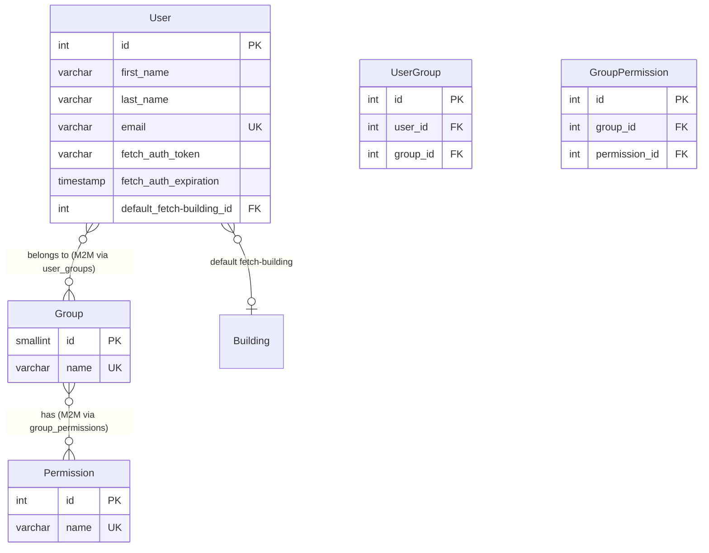

### 5e. Configuration & ILS Integration

Lookup tables that parameterize the system, plus the ILS adapter configuration that enables FOLIO integration per-Owner.

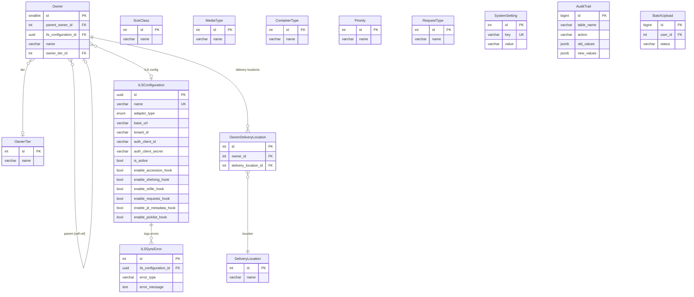

### 5f. Many-to-Many Link Tables

These association tables power the M2M relationships between workflow jobs and inventory objects.

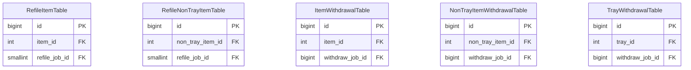

---

## Cross-Reference: Domain Connections

The diagram below shows how the five domain groups connect to each other at a high level.

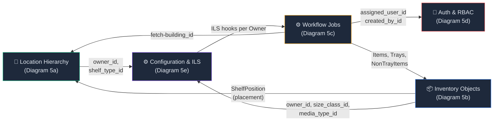

