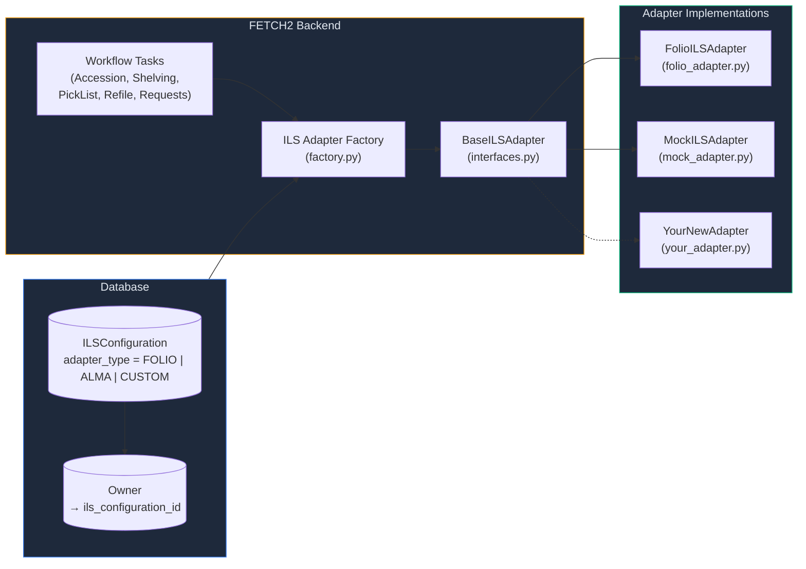
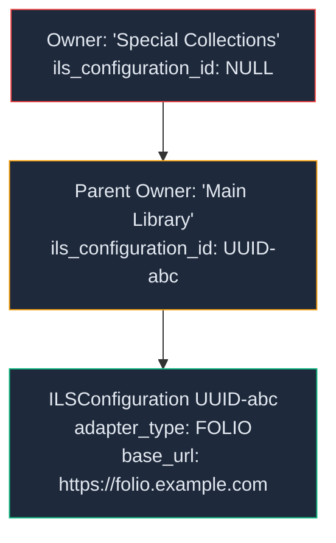
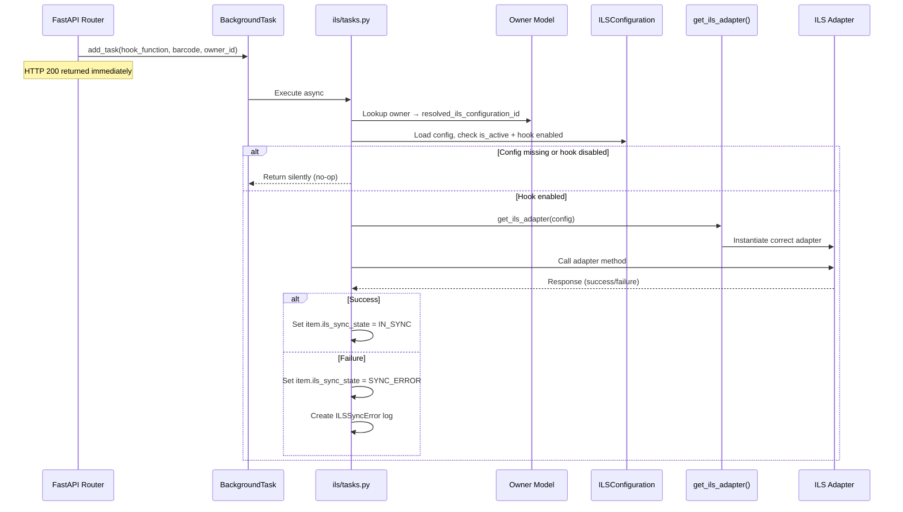

# ILS Integration Guide

This guide documents the FETCH2 platform's Integrated Library System (ILS) adapter architecture. It covers the current design, how the system connects to external ILS platforms (like FOLIO), and provides a step-by-step walkthrough for building a new adapter (e.g., for Ex Libris Alma, Sierra, or a custom middleware layer).

---

## Table of Contents

1. [Architecture Overview](#1-architecture-overview)
2. [The Adapter Pattern](#2-the-adapter-pattern)
3. [Configuration Model](#3-configuration-model)
4. [Workflow Hooks](#4-workflow-hooks)
5. [Error Tracking](#5-error-tracking)
6. [Existing Adapters](#6-existing-adapters)
7. [Building a New Adapter](#7-building-a-new-adapter)
8. [Registration & Deployment](#8-registration--deployment)
9. [Testing](#9-testing)

---

## 1. Architecture Overview

FETCH2 uses the **Adapter Pattern** to decouple its core workflow logic from any specific ILS vendor. This means the shelving, accession, picklist, refile, and request workflows never call an ILS API directly — they call a standardized interface, and a factory instantiates the correct vendor-specific adapter at runtime based on the `ILSConfiguration` stored in the database.



### Key Design Principles

- **Per-Owner Configuration**: Each `Owner` in FETCH can have its own `ILSConfiguration`. An owner hierarchy supports **inheritance** — if a child owner has no configuration, it walks up the parent chain via `resolved_ils_configuration_id`.
- **Per-Hook Toggle**: Each integration can selectively enable/disable individual workflow hooks (accession validation, shelving check-in, refile check-in, picklist check-in, request sync, JIT metadata). This means you can onboard an ILS incrementally.
- **Background Execution**: All ILS calls are executed as **FastAPI `BackgroundTasks`**, never blocking the user's HTTP request. The user scans a barcode → gets an immediate response → the ILS sync happens asynchronously.
- **Error Dashboard**: Failed sync operations are logged to the `ils_sync_errors` table with workflow context, enabling staff to review, retry, or resolve errors from the admin UI.

---

## 2. The Adapter Pattern

### Source File

`inventory_service/app/ils/interfaces.py`

### Abstract Base Class

Every ILS adapter must inherit from `BaseILSAdapter` and implement four abstract methods:

```python
class BaseILSAdapter(ABC):

    def __init__(
        self,
        base_url: str,
        tenant_id: str,
        auth_client_id: str,
        auth_client_secret: str,
        auth_token_url: Optional[str] = None,
        ils_service_point_id: Optional[str] = None,
        expected_shelved_status: str = "Available",
        expected_refile_status: str = "In Transit",
        expected_picklist_status: str = "In Transit"
    ):
        # All fields are stored as instance attributes
        ...

    @abstractmethod
    def validate_item(self, barcode: str) -> bool:
        """[ACCESSION] Confirm barcode exists in the ILS."""

    @abstractmethod
    def fetch_item_metadata(self, barcode: str) -> ILSItemMetadata:
        """[JIT METADATA] Fetch title, author, call number from the ILS."""

    @abstractmethod
    def check_in_item(self, barcode: str) -> ILSCheckInResponse:
        """[SHELVING / REFILE / PICKLIST] Check in the item in the ILS."""

    @abstractmethod
    def fetch_pending_requests(self) -> List[ILSRequestItem]:
        """[REQUESTS] Poll for open page/hold requests from the ILS."""
```

### Data Transfer Objects (DTOs)

The interface also defines four Pydantic models that standardize the data contract between FETCH and any ILS:

| DTO | Purpose | Key Fields |
|---|---|---|
| `ILSCheckInStatus` | Enum of possible check-in outcomes | `AVAILABLE`, `IN_TRANSIT`, `ON_HOLD`, `MISSING`, `UNKNOWN`, `SYNC_ERROR` |
| `ILSCheckInResponse` | Result of a check-in operation | `success: bool`, `status: ILSCheckInStatus`, `raw_status_string: str`, `error_message: str` |
| `ILSItemMetadata` | Bibliographic metadata for JIT display | `title`, `author`, `call_number`, `material_type`, `is_valid_location` |
| `ILSRequestItem` | A single pending patron request from the ILS | `request_id`, `item_barcode`, `patron_id`, `destination` |

---

## 3. Configuration Model

### Source File

`inventory_service/app/models/ils_configurations.py`

Each ILS integration is represented by a row in the `ils_configurations` table:

| Column | Type | Purpose |
|---|---|---|
| `id` | UUID | Primary key |
| `name` | varchar(150) | Human-readable label (e.g., "FOLIO Production - Main Library") |
| `adapter_type` | enum | `FOLIO`, `ALMA`, or `CUSTOM_MIDDLEWARE` — determines which adapter class is instantiated |
| `base_url` | varchar(255) | Root URL of the ILS API (e.g., `https://folio.example.com/okapi`) |
| `tenant_id` | varchar(100) | Tenant identifier (e.g., OKAPI tenant for FOLIO) |
| `auth_client_id` | varchar(255) | OAuth client ID or API key |
| `auth_client_secret` | varchar(500) | OAuth client secret (injected via K8s Secrets in production) |
| `auth_token_url` | varchar(255) | OAuth token endpoint (e.g., Keycloak realm URL for FOLIO Eureka) |
| `ils_service_point_id` | varchar(50) | The ILS service point UUID representing this storage facility |
| `expected_shelved_status` | varchar(100) | Status string the ILS should return after shelving check-in (default: `"Available"`) |
| `expected_refile_status` | varchar(100) | Status string expected after refile check-in (default: `"Available"`) |
| `expected_picklist_status` | varchar(100) | Status string expected after picklist check-in (default: `"In Transit"`) |
| `is_active` | bool | Master on/off switch for the entire configuration |
| `enable_accession_hook` | bool | Enable barcode validation during accession |
| `enable_shelving_hook` | bool | Enable check-in after shelving |
| `enable_refile_hook` | bool | Enable check-in after refile |
| `enable_picklist_hook` | bool | Enable check-in after picklist retrieval |
| `enable_requests_hook` | bool | Enable polling for ILS patron requests |
| `enable_jit_metadata_hook` | bool | Enable JIT metadata lookup from item detail |

### Owner-to-Configuration Resolution



The `Owner.resolved_ils_configuration_id` property recursively walks the parent hierarchy:

```python
@property
def resolved_ils_configuration_id(self):
    if self.ils_configuration_id is not None:
        return self.ils_configuration_id
    if self.parent_owner:
        return self.parent_owner.resolved_ils_configuration_id
    return None  # No integration configured
```

This means child owners (e.g., subcollections) automatically inherit their parent's ILS configuration unless overridden.

---

## 4. Workflow Hooks

Each hook follows the same execution pattern:



### Hook Reference

| Hook | Task Function | Triggered By | Adapter Method | Expected Status Field |
|---|---|---|---|---|
| **Accession Validation** | `validate_accessioned_item_async` | `POST /items/` and `POST /non-tray-items/` (item creation) | `validate_item()` | N/A (bool) |
| **Shelving Check-In** | `check_in_shelved_item_async` | Shelving job completion (`tasks.py`) | `check_in_item()` | `expected_shelved_status` |
| **PickList Check-In** | `check_in_picklist_item_async` | PickList scan endpoint | `check_in_item()` | `expected_picklist_status` |
| **Refile Check-In** | *(Planned — `enable_refile_hook` exists but task is not yet wired)* | — | `check_in_item()` | `expected_refile_status` |
| **Request Sync** | `sync_requests_async` | `POST /ils-configurations/sync-requests` (manual trigger) | `fetch_pending_requests()` | N/A |
| **JIT Metadata** | *(Inline, not async)* | `GET /items/barcode/{value}/metadata` and `GET /items/{barcode_value}/ils-metadata` | `fetch_item_metadata()` | N/A |

---

## 5. Error Tracking

### Source Files

- `inventory_service/app/models/ils_sync_errors.py`
- `inventory_service/app/routers/ils_sync_errors.py`

When an ILS operation fails (adapter returns `success=False`, status mismatch, or exception), the system:

1. Sets the item's `ils_sync_state` to `SYNC_ERROR`
2. Creates an `ILSSyncError` record with:

| Field | Purpose |
|---|---|
| `item_barcode` | The barcode that failed |
| `workflow_action` | Which hook failed: `ACCESSION`, `SHELVING`, `REFILE`, `REQUEST_SYNC`, `PICKLIST` |
| `error_message` | Human-readable description |
| `status` | `ACTIVE` → `RESOLVED` or `IGNORED` |
| `resolved_by_user_id` | Who resolved it |
| `resolved_at` | When it was resolved |

### Admin API Endpoints

| Endpoint | Method | Purpose |
|---|---|---|
| `GET /ils-sync-errors/` | GET | Paginated list of sync errors (filterable by status) |
| `PATCH /ils-sync-errors/{id}/resolve` | PATCH | Mark an error as resolved |
| `POST /ils-sync-errors/{id}/retry` | POST | Re-run the failed hook as a background task |

---

## 6. Existing Adapters

### FolioILSAdapter

**Source**: `inventory_service/app/ils/folio_adapter.py`

The production adapter for FOLIO (Eureka platform). Key implementation details:

| Feature | Implementation |
|---|---|
| **Authentication** | OAuth 2.0 Client Credentials Grant via `_get_auth_headers()`. Tokens are cached with 30-second expiry buffer |
| **HTTP Client** | `httpx` (synchronous) with 10–15 second timeouts |
| **validate_item()** | `GET /inventory/items?query=(barcode=="...")` → checks `totalRecords > 0` |
| **check_in_item()** | `POST /circulation/check-in-by-barcode` with `servicePointId` and ISO timestamp |
| **fetch_item_metadata()** | `GET /inventory/items?query=(barcode=="...")` → extracts title, contributorNames, callNumber, materialType |
| **fetch_pending_requests()** | `GET /circulation/requests?query=(status=="Open - Not yet filled" and requestType=="Page")` filtered by `pickupServicePointId` |

### MockILSAdapter

**Source**: `inventory_service/app/ils/mock_adapter.py`

A testing adapter that simulates ILS responses without any network calls:

- `validate_item()` — returns `False` for barcodes starting with `"FAIL"`, `True` otherwise
- `check_in_item()` — returns `MISSING` for `"FAIL"` barcodes, `ON_HOLD` for `"HOLD"` barcodes, `AVAILABLE` otherwise
- `fetch_item_metadata()` — returns synthetic mock data
- `fetch_pending_requests()` — returns two hardcoded mock requests

The `CUSTOM_MIDDLEWARE` and `ALMA` adapter types currently map to `MockILSAdapter` as placeholders.

---

## 7. Building a New Adapter

Follow these steps to add support for a new ILS (using "Alma" as the example).

### Step 1: Create the Adapter File

Create `inventory_service/app/ils/alma_adapter.py`:

```python
import httpx
from typing import List, Optional
from datetime import datetime, timezone

from app.logger import inventory_logger
from app.ils.interfaces import (
    BaseILSAdapter,
    ILSCheckInResponse,
    ILSItemMetadata,
    ILSCheckInStatus,
    ILSRequestItem
)


class AlmaILSAdapter(BaseILSAdapter):
    """
    ILS Adapter for Ex Libris Alma.
    Implements the BaseILSAdapter contract using Alma's REST APIs.
    """

    def __init__(self, *args, **kwargs):
        super().__init__(*args, **kwargs)
        # Alma uses API Keys, not OAuth. We'll use auth_client_secret as the API key.
        self.api_key = self.auth_client_secret

    def _get_headers(self) -> dict:
        """Build Alma API headers using API key authentication."""
        return {
            "Authorization": f"apikey {self.api_key}",
            "Accept": "application/json",
            "Content-Type": "application/json"
        }

    def validate_item(self, barcode: str) -> bool:
        """
        [ACCESSION WORKFLOW]
        Check if the barcode exists in Alma's inventory.
        Alma API: GET /almaws/v1/items?item_barcode={barcode}
        """
        try:
            headers = self._get_headers()
            url = f"{self.base_url.rstrip('/')}/almaws/v1/items"
            params = {"item_barcode": barcode}

            resp = httpx.get(url, headers=headers, params=params, timeout=10)
            return resp.status_code == 200
        except Exception as e:
            inventory_logger.error(f"Alma validate_item error: {e}")
            return False

    def fetch_item_metadata(self, barcode: str) -> Optional[ILSItemMetadata]:
        """
        [JIT METADATA LOOKUP]
        Fetch bibliographic data from Alma.
        """
        try:
            headers = self._get_headers()
            url = f"{self.base_url.rstrip('/')}/almaws/v1/items"
            params = {"item_barcode": barcode}

            resp = httpx.get(url, headers=headers, params=params, timeout=10)
            resp.raise_for_status()
            data = resp.json()

            bib_data = data.get("bib_data", {})
            item_data = data.get("item_data", {})

            return ILSItemMetadata(
                title=bib_data.get("title", "Unknown"),
                author=bib_data.get("author"),
                call_number=item_data.get("alternative_call_number"),
                material_type=item_data.get("physical_material_type", {}).get("desc"),
                is_valid_location=True
            )
        except Exception as e:
            inventory_logger.error(f"Alma fetch_item_metadata error: {e}")
            return None

    def check_in_item(self, barcode: str) -> ILSCheckInResponse:
        """
        [SHELVING / REFILE / PICKLIST]
        Perform a scan-in operation in Alma.
        Alma API: POST /almaws/v1/items?item_barcode={barcode}&op=scan
        """
        try:
            headers = self._get_headers()
            url = f"{self.base_url.rstrip('/')}/almaws/v1/items"
            params = {
                "item_barcode": barcode,
                "op": "scan",
                "library": self.tenant_id,     # Alma uses library code
                "circ_desk": self.ils_service_point_id or "DEFAULT_CIRC_DESK"
            }

            resp = httpx.post(url, headers=headers, params=params, timeout=10)

            if resp.status_code == 200:
                data = resp.json()
                raw_status = data.get("item_data", {}).get("base_status", {}).get("desc", "")

                return ILSCheckInResponse(
                    success=True,
                    status=ILSCheckInStatus.AVAILABLE if "Item in place" in raw_status
                           else ILSCheckInStatus.UNKNOWN,
                    raw_status_string=raw_status,
                )
            else:
                return ILSCheckInResponse(
                    success=False,
                    status=ILSCheckInStatus.SYNC_ERROR,
                    raw_status_string="",
                    error_message=f"Alma scan-in failed: {resp.text}"
                )
        except Exception as e:
            inventory_logger.error(f"Alma check_in_item error: {e}")
            return ILSCheckInResponse(
                success=False,
                status=ILSCheckInStatus.SYNC_ERROR,
                raw_status_string="",
                error_message=str(e)
            )

    def fetch_pending_requests(self) -> List[ILSRequestItem]:
        """
        [REQUESTS WORKFLOW]
        Poll Alma for pending resource sharing or hold requests.
        """
        try:
            headers = self._get_headers()
            # Alma lending requests endpoint
            url = f"{self.base_url.rstrip('/')}/almaws/v1/task-lists/lending-requests"
            params = {"status": "NEW", "limit": 50}

            resp = httpx.get(url, headers=headers, params=params, timeout=15)
            resp.raise_for_status()
            data = resp.json()

            results = []
            for req in data.get("lending_request", []):
                results.append(ILSRequestItem(
                    request_id=req.get("request_id", ""),
                    item_barcode=req.get("barcode", ""),
                    patron_id=req.get("requester", {}).get("value", "Unknown"),
                    destination=req.get("pickup_location", "Default")
                ))
            return results
        except Exception as e:
            inventory_logger.error(f"Alma fetch_pending_requests error: {e}")
            return []
```

### Step 2: Register in the Adapter Enum

Add your new type to `AdapterTypeEnum` in `inventory_service/app/models/ils_configurations.py`:

```diff
 class AdapterTypeEnum(str, enum.Enum):
     FOLIO = "FOLIO"
     ALMA = "ALMA"
     CUSTOM_MIDDLEWARE = "CUSTOM_MIDDLEWARE"
+    SIERRA = "SIERRA"  # Example: adding Sierra support
```

> **Note**: This requires an Alembic migration to update the PostgreSQL enum type.

### Step 3: Register in the Factory

Update `inventory_service/app/ils/factory.py` to import and return your adapter:

```diff
 from app.ils.mock_adapter import MockILSAdapter
 from app.ils.folio_adapter import FolioILSAdapter
+from app.ils.alma_adapter import AlmaILSAdapter

 def get_ils_adapter(config: ILSConfiguration) -> BaseILSAdapter:
     ...
     elif config.adapter_type == AdapterTypeEnum.ALMA:
-         return MockILSAdapter(...)   # Placeholder
+         return AlmaILSAdapter(
+             base_url=config.base_url,
+             tenant_id=config.tenant_id,
+             auth_client_id=config.auth_client_id,
+             auth_client_secret=config.auth_client_secret,
+             auth_token_url=config.auth_token_url,
+             ils_service_point_id=config.ils_service_point_id,
+             expected_shelved_status=config.expected_shelved_status,
+             expected_refile_status=config.expected_refile_status,
+             expected_picklist_status=config.expected_picklist_status
+         )
```

### Step 4: Create the ILSConfiguration Record

Use the admin UI or the API directly:

```bash
curl -X POST https://your-fetch-instance/ils-configurations/ \
  -H "Content-Type: application/json" \
  -d '{
    "name": "Alma Production - Main Library",
    "adapter_type": "ALMA",
    "base_url": "https://api-na.hosted.exlibrisgroup.com",
    "tenant_id": "MAIN_LIB",
    "auth_client_id": "",
    "auth_client_secret": "<YOUR_ALMA_API_KEY>",
    "auth_token_url": null,
    "ils_service_point_id": "DEFAULT_CIRC_DESK",
    "expected_shelved_status": "Item in place",
    "expected_refile_status": "Item in place",
    "expected_picklist_status": "Not in place",
    "is_active": true,
    "enable_accession_hook": true,
    "enable_shelving_hook": true,
    "enable_refile_hook": false,
    "enable_requests_hook": false,
    "enable_jit_metadata_hook": true,
    "enable_picklist_hook": false
  }'
```

### Step 5: Assign to Owner(s)

Link the configuration to the appropriate Owner via `PATCH /owners/{id}`:

```bash
curl -X PATCH https://your-fetch-instance/owners/1 \
  -H "Content-Type: application/json" \
  -d '{"ils_configuration_id": "<UUID_FROM_STEP_4>"}'
```

All child owners without their own configuration will inherit this automatically.

---

## 8. Registration & Deployment

### Checklist

- [ ] **Adapter file created** in `inventory_service/app/ils/`
- [ ] **Inherits from `BaseILSAdapter`** and implements all 4 abstract methods
- [ ] **Registered in `AdapterTypeEnum`** (`models/ils_configurations.py`)
- [ ] **Alembic migration created** for the new enum value (`alembic revision --autogenerate`)
- [ ] **Registered in the factory** (`ils/factory.py`)
- [ ] **ILSConfiguration record created** via API or admin UI
- [ ] **Assigned to Owner(s)** via `ils_configuration_id`
- [ ] **Hook toggles configured** (start with one hook, validate, then enable others)
- [ ] **Secrets injected** via Kubernetes Secrets or environment variables (never bake credentials into the image)

### Alembic Migration for New Enum Value

When adding a new `AdapterTypeEnum` value, you'll need a migration:

```python
"""add_sierra_adapter_type

Revision ID: xxxx
"""
from alembic import op

def upgrade():
    op.execute("ALTER TYPE adapter_type_enum ADD VALUE IF NOT EXISTS 'SIERRA'")

def downgrade():
    pass  # PostgreSQL does not support removing enum values
```

---

## 9. Testing

### Using the MockILSAdapter

For development and testing, set `adapter_type` to `CUSTOM_MIDDLEWARE` on your ILSConfiguration. This routes all calls to the `MockILSAdapter` which:

- Returns predictable responses without network calls
- Simulates failures for barcodes starting with `"FAIL"`
- Simulates hold scenarios for barcodes starting with `"HOLD"`
- Uses the `expected_shelved_status` from config to simulate a perfect match

### Testing Your New Adapter

1. **Unit test the adapter in isolation** — mock `httpx` responses and verify your adapter correctly maps them to the standard DTOs
2. **Integration test with a sandbox** — point `base_url` at the ILS vendor's sandbox environment and run the hooks manually via the API
3. **Test the error path** — verify that when your adapter returns `success=False` or throws an exception, the system correctly creates `ILSSyncError` records and sets `ils_sync_state = SYNC_ERROR`
4. **Test the retry flow** — create a sync error, then call `POST /ils-sync-errors/{id}/retry` to verify the background re-execution

### Verifying Hook Execution

Since hooks run as background tasks, you can verify execution by:

1. Checking the `ils_sync_state` field on the Item/NonTrayItem record (`IN_SYNC` or `SYNC_ERROR`)
2. Querying `GET /ils-sync-errors/?status=ACTIVE` for any new error records
3. Monitoring the application logs for `inventory_logger` output prefixed with your adapter name

---

## File Reference

| File | Purpose |
|---|---|
| [`interfaces.py`](inventory_service/app/ils/interfaces.py) | Abstract base class + DTOs |
| [`factory.py`](inventory_service/app/ils/factory.py) | Adapter factory — maps `AdapterTypeEnum` → concrete class |
| [`folio_adapter.py`](inventory_service/app/ils/folio_adapter.py) | Production FOLIO adapter (OAuth 2.0 + OKAPI) |
| [`mock_adapter.py`](inventory_service/app/ils/mock_adapter.py) | Testing adapter (no network calls) |
| [`tasks.py`](inventory_service/app/ils/tasks.py) | Background task functions for each workflow hook |
| [`ils_configurations.py`](inventory_service/app/models/ils_configurations.py) | SQLAlchemy model + `AdapterTypeEnum` |
| [`ils_sync_errors.py`](inventory_service/app/models/ils_sync_errors.py) | Sync error tracking model |
| [`ils_configurations router`](inventory_service/app/routers/ils_configurations.py) | CRUD API + request sync trigger |
| [`ils_sync_errors router`](inventory_service/app/routers/ils_sync_errors.py) | Error dashboard API (list, resolve, retry) |
