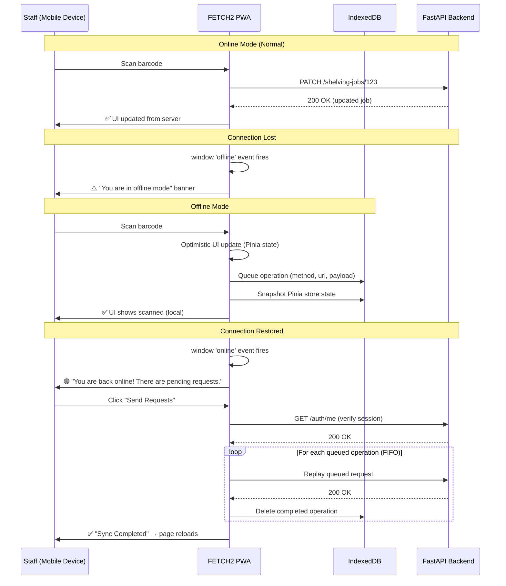
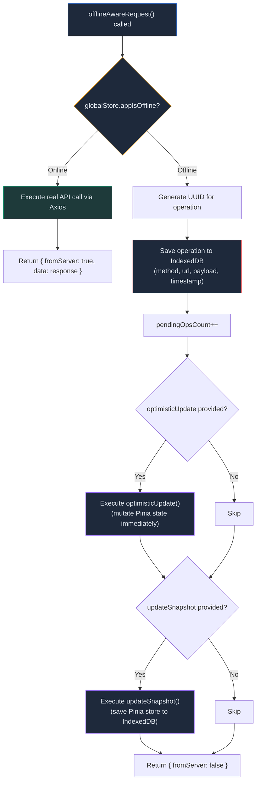
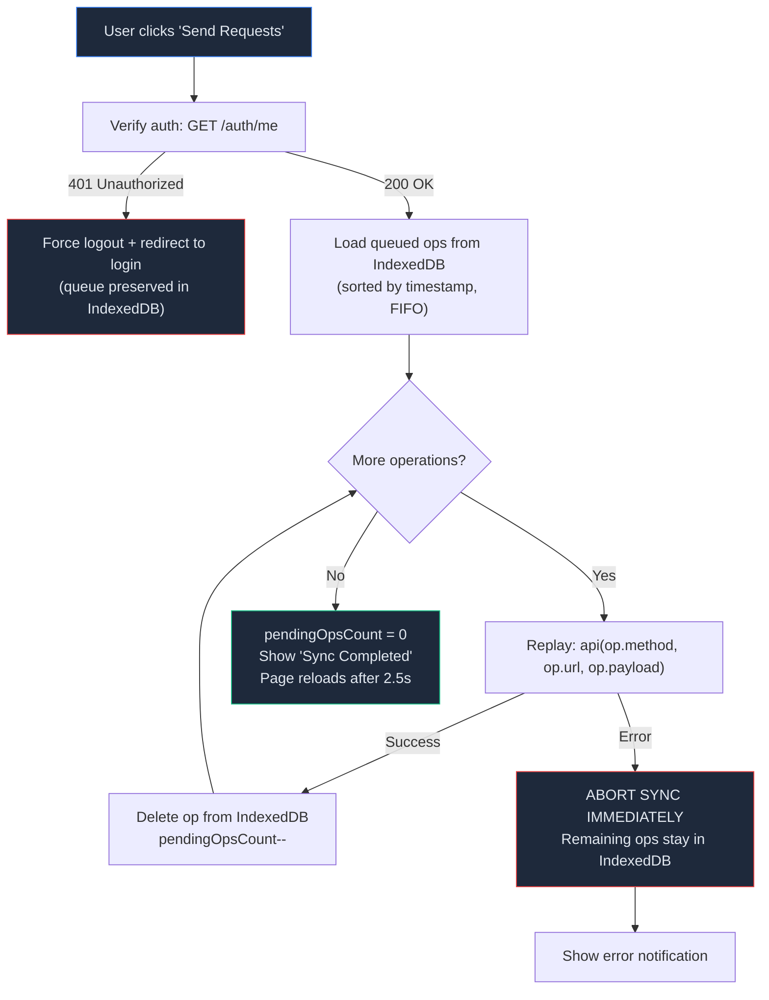
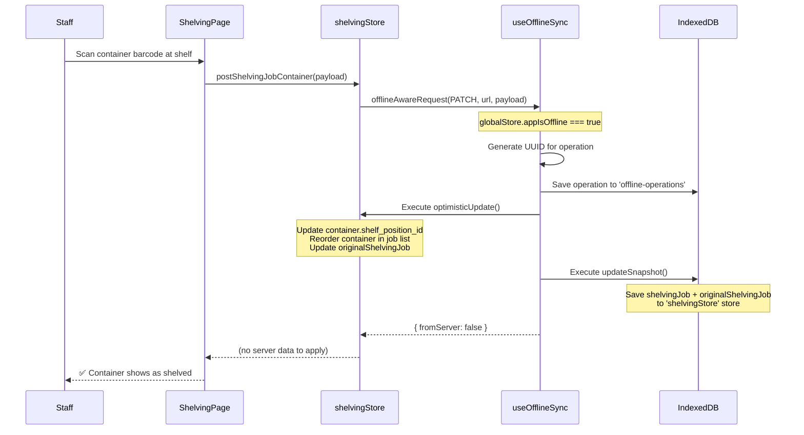
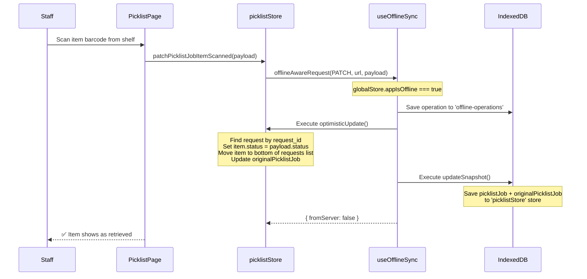
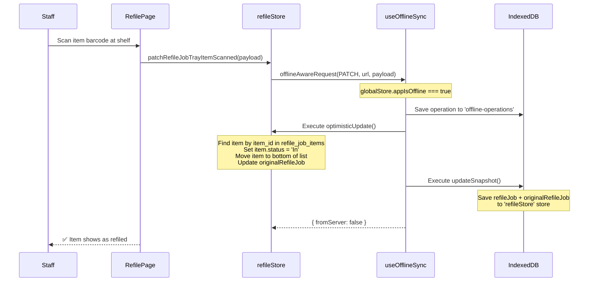

# Offline Mode Guide

This guide documents how FETCH2's offline mode works at every layer of the stack — from the Service Worker and IndexedDB storage, through the `useOfflineSync` composable, to the specific offline-capable actions in the Shelving, PickList, and Refile workflows.

---

## Table of Contents

1. [Overview](#1-overview)
2. [PWA Foundation](#2-pwa-foundation)
3. [Offline Detection](#3-offline-detection)
4. [The Offline Sync Engine](#4-the-offline-sync-engine)
5. [IndexedDB Storage](#5-indexeddb-storage)
6. [Re-Sync Flow](#6-re-sync-flow)
7. [Shelving Jobs — Offline Mode](#7-shelving-jobs--offline-mode)
8. [PickList Jobs — Offline Mode](#8-picklist-jobs--offline-mode)
9. [Refile Jobs — Offline Mode](#9-refile-jobs--offline-mode)
10. [Navigation Guards](#10-navigation-guards)
11. [Limitations & Edge Cases](#11-limitations--edge-cases)

---

## 1. Overview

FETCH2 is a **Progressive Web App (PWA)** that staff use on mobile devices in warehouse aisles where Wi-Fi coverage can be intermittent. Offline mode ensures that **active workflow jobs** (shelving, picklist retrieval, and refile) can continue without interruption — all scan operations are queued locally and replayed to the server when connectivity is restored.

### How It Works at a High Level



---

## 2. PWA Foundation

### Build Configuration

FETCH2 is built as a Quasar PWA using `injectManifest` mode, which gives full control over the Service Worker:

```javascript
// quasar.config.js
pwa: {
  workboxMode: 'injectManifest',
  swFilename: 'sw.js',
  manifestFilename: 'manifest.json',
  useCredentialsForManifestTag: false,
  useFilenameHashes: false,
}
```

**Build commands:**
- `quasar dev -m pwa` — development with service worker
- `quasar build -m pwa` — production build with precaching

### Service Worker (`src-pwa/custom-service-worker.js`)

The custom service worker handles two responsibilities:

1. **Precaching**: All static assets (HTML, JS, CSS, images) are cached via Workbox's `precacheAndRoute`, enabling the app shell to load without network.
2. **API Caching**: All API requests (except `/tiers`) use a **NetworkFirst** strategy — try the network, fall back to cache.

```javascript
// Precache all static files for offline shell
precacheAndRoute(self.__WB_MANIFEST)

// API requests: network-first with cache fallback
registerRoute(
  ({ url }) => url.href.startsWith(process.env.VITE_INV_SERVCE_API)
               && !url.href.includes('/tiers'),
  new NetworkFirst()
)
```

This means:
- The **app shell always loads**, even without network
- **Previously fetched API data** (job details, container lists) is available from cache
- **Write operations** (PATCH, POST, DELETE) that fail offline are handled by the application-layer queue, not the service worker

### Service Worker Updates

When a new version is deployed, the `register-service-worker.js` file displays an update notification. Accepting the update clears all IndexedDB databases **except** `workbox-background-sync` (preserving the API cache), then reloads the page.

---

## 3. Offline Detection

### Browser Events → Global State

The `NavigationBar.vue` component listens for browser connectivity events and reflects them in the Pinia `globalStore`:

```javascript
// NavigationBar.vue
onMounted(() => {
  window.addEventListener('offline', () => {
    showOfflineBanner.value = true
    appIsOffline.value = true        // → globalStore.appIsOffline
  })
  window.addEventListener('online', () => {
    showOfflineBanner.value = false
    appIsOffline.value = false
  })
})
```

### Global Store State

```javascript
// global-store.js
state: () => ({
  appIsOffline: false,      // True when browser has no network
  appPendingSync: false,     // True when online + queued operations exist
  appSyncGuard: null,        // Route guard for unsaved offline work
})
```

### UI Banners

| Condition | Banner | Color |
|---|---|---|
| `appIsOffline === true` | "You are in offline mode." | ⚠️ Amber |
| `appPendingSync === true && !appIsOffline` | "You are back online! There are pending requests." + **"Send Requests"** button | 🟢 Green |

---

## 4. The Offline Sync Engine

### Source File

`vue/src/composables/useOfflineSync.js`

This is the core composable that every offline-capable store action uses. It exports:

| Export | Purpose |
|---|---|
| `pendingOpsCount` | Reactive `ref` — number of queued operations (drives banner visibility) |
| `offlineAwareRequest()` | Smart request dispatcher — online → API, offline → queue |
| `syncPendingOps()` | Replays all queued operations sequentially when back online |
| `getPendingOperations()` | Reads all queued ops from IndexedDB, sorted by timestamp (FIFO) |

### `offlineAwareRequest()` — The Core Function

Every store action that needs offline support calls this instead of `api.get/post/patch`:

```javascript
const res = await offlineAwareRequest({
  method: 'PATCH',                              // HTTP method
  url: `/shelving-jobs/${payload.id}`,           // API endpoint
  payload,                                       // Request body
  optimisticUpdate: () => { ... },               // Immediate Pinia state mutation
  updateSnapshot: async () => { ... }            // Persist Pinia state to IndexedDB
})
```

**Decision flow:**



### What Gets Stored Per Operation

Each queued operation in IndexedDB contains:

```json
{
  "id": "a1b2c3d4-...",
  "timestamp": 1714200000000,
  "method": "PATCH",
  "url": "/shelving-jobs/42",
  "payload": { "id": 42, "status": "Complete" }
}
```

---

## 5. IndexedDB Storage

### Source File

`vue/src/composables/useIndexDbHandler.js`

FETCH2 uses a single IndexedDB database named `global-data` (version 3) with five object stores:

| Object Store | Purpose |
|---|---|
| `offline-operations` | Queue of API requests waiting to be replayed |
| `shelvingStore` | Snapshot of the shelving Pinia store state (job + containers) |
| `picklistStore` | Snapshot of the picklist Pinia store state (job + requests) |
| `refileStore` | Snapshot of the refile Pinia store state (job + items) |
| `ownerTiers` | Cached owner tier lookup data for offline dropdown use |

### Why Snapshots?

When a user goes offline and scans containers, the Pinia state is updated **optimistically** (e.g., marking a container as `scanned_for_shelving: true`). But Pinia state is in-memory and would be lost if the browser tab closes or the device sleeps. The **snapshot** writes the current Pinia state to IndexedDB so it survives page reloads:

```javascript
updateSnapshot: async () => {
  await addDataToIndexDb('shelvingStore', 'shelvingJob',
    JSON.parse(JSON.stringify(this.shelvingJob)))
  await addDataToIndexDb('shelvingStore', 'originalShelvingJob',
    JSON.parse(JSON.stringify(this.originalShelvingJob)))
}
```

When the page reloads while offline, the store can rehydrate from IndexedDB instead of making a network request.

---

## 6. Re-Sync Flow

### Source

`NavigationBar.vue` → `triggerBackgroundSync()` → `syncPendingOps()`

When connectivity is restored and the user clicks **"Send Requests"**, the sync engine:



### Key Safety Features

1. **Auth-First**: The sync always verifies the JWT session before replaying. If the token expired during the offline period, the user is redirected to login. The **queue is preserved** — operations are not deleted, so the user can log back in and retry.

2. **Abort-on-Error**: If any operation fails (e.g., a 409 conflict because the server state diverged), the sync stops immediately. Remaining operations stay in IndexedDB exactly as queued.

3. **Full Page Reload**: After successful sync, the page reloads after 2.5 seconds. This ensures the Pinia stores are rehydrated from fresh server data, eliminating any divergence between optimistic local state and actual server state.

---

## 7. Shelving Jobs — Offline Mode

### Store: `shelving-store.js`

The shelving store has **4 offline-capable actions**:

| Action | Method | API Endpoint | Optimistic Update |
|---|---|---|---|
| `patchShelvingJob` | PATCH | `/shelving-jobs/{id}` | Updates `shelvingJob.status` locally |
| `postShelvingJobContainer` | POST | `/shelving-jobs/{id}/reassign-container-location` | Updates container's `shelf_position_id`, reorders container list |
| `postShelvingJobContainerProposedLocation` | POST | `/shelving-jobs/{id}/reassign-proposed-location` | Updates container's position and reorders list |
| `confirmContainerShelved` | POST | `/shelving-jobs/{id}/confirm-shelve` | Returns `{ status: 'queued_offline' }` for component-level handling |

### Example: Shelving a Container Offline

When a staff member scans a container barcode at a shelf position while offline:



### Snapshot Contents

After each offline shelving action, the following is persisted to IndexedDB:

| IndexedDB Key | Store Path | Data |
|---|---|---|
| `shelvingStore → shelvingJob` | `this.shelvingJob` | Full job object including all trays, non_tray_items, status, building |
| `shelvingStore → originalShelvingJob` | `this.originalShelvingJob` | Copy of job used for dirty-checking |

---

## 8. PickList Jobs — Offline Mode

### Store: `picklist-store.js`

The picklist store has **3 offline-capable actions**:

| Action | Method | API Endpoint | Optimistic Update |
|---|---|---|---|
| `patchPicklistJob` | PATCH | `/pick-lists/{id}` | Updates `picklistJob.status` locally |
| `patchPicklistJobItemScanned` | PATCH | `/pick-lists/{id}/update_request/{request_id}` | Changes item status (e.g., `PickList` → `Out`), moves item to bottom of list |
| `deletePicklistJobItem` | DELETE | `/pick-lists/{id}/remove_request/{item_id}` | Removes request from `picklistJob.requests` array |

### Example: Scanning a PickList Item Offline

When a staff member retrieves an item from a shelf during a picklist job while offline:



### Snapshot Contents

| IndexedDB Key | Store Path | Data |
|---|---|---|
| `picklistStore → picklistJob` | `this.picklistJob` | Full job with all requests and their item/non_tray_item objects |
| `picklistStore → originalPicklistJob` | `this.originalPicklistJob` | Copy for dirty-checking |

---

## 9. Refile Jobs — Offline Mode

### Store: `refile-store.js`

The refile store has **4 offline-capable actions**:

| Action | Method | API Endpoint | Optimistic Update |
|---|---|---|---|
| `patchRefileJob` | PATCH | `/refile-jobs/{id}` | Updates `refileJob.status` locally |
| `deleteRefileJobItems` | DELETE | `/refile-jobs/{id}/remove_items` | Filters items out of `refile_job_items` by barcode |
| `patchRefileJobTrayItemScanned` | PATCH | `/refile-jobs/{id}/update_item/{item_id}` | Sets item `status = 'In'`, moves to bottom of list |
| `patchRefileJobNonTrayItemScanned` | PATCH | `/refile-jobs/{id}/update_non_tray_items/{id}` | Sets non-tray item `status = 'In'`, moves to bottom of list |

### Example: Scanning a Refile Item Offline

When a staff member scans a returned item back onto a shelf during a refile job:



### Snapshot Contents

| IndexedDB Key | Store Path | Data |
|---|---|---|
| `refileStore → refileJob` | `this.refileJob` | Full job with all `refile_job_items` and their statuses |
| `refileStore → originalRefileJob` | `this.originalRefileJob` | Copy for dirty-checking |

---

## 10. Navigation Guards

When a user has pending offline operations and tries to navigate away from the current workflow, the `NavigationBar` displays a sync guard modal:

- **"You have pending requests. Are you sure you want to leave?"**
- **"Yes, Ignore Requests"** — navigates away. Operations remain in IndexedDB and will sync when the user clicks "Send Requests" from any page.
- **"Cancel"** — stays on the current page.

This prevents accidental loss of context. The operations themselves are **never deleted** by the guard — only the user's place in the workflow is at risk.

---

## 11. Limitations & Edge Cases

### What Works Offline

| Feature | Offline Support |
|---|---|
| Shelving: assign location, confirm shelve | ✅ Full |
| PickList: scan items, update status, remove items | ✅ Full |
| Refile: scan items/non-tray items, update status, remove items | ✅ Full |
| Job status changes (Complete, In Progress) | ✅ Full |
| Viewing cached job data | ✅ Via Workbox NetworkFirst cache |

### What Does NOT Work Offline

| Feature | Reason |
|---|---|
| **Creating** new jobs | Requires server-side ID generation and validation |
| **Barcode lookups** (`GET /shelves/barcode/...`) | Read-only fetches are not queued |
| **Accession / Verification scanning** | Not wired into `offlineAwareRequest` |
| **Search** | Server-side full-text query required |
| **Admin operations** | CRUD for users, groups, buildings, configs |
| **Reports** | Server-side aggregation required |
| **ILS Integration hooks** | Server-to-server calls, cannot queue on client |

### Edge Cases

| Scenario | Behavior |
|---|---|
| **JWT expires during offline session** | Sync verifies auth first. If 401, user is redirected to login. Queue is preserved. |
| **Server state diverged** (e.g., another user completed the job) | The replayed request may return 4xx. Sync aborts. Remaining ops stay queued. |
| **Browser tab closed while offline** | Operations survive in IndexedDB. Pinia state is rehydrated from snapshots on next load. |
| **PWA update deployed while offline** | User is prompted to update on reconnection. IndexedDB is cleared except `workbox-background-sync`. |
| **Multiple devices** | Offline queues are per-device. Syncing from two devices simultaneously may cause conflicts. |

---

## File Reference

| File | Layer | Purpose |
|---|---|---|
| [`custom-service-worker.js`](vue/src-pwa/custom-service-worker.js) | Service Worker | Precaching + NetworkFirst API caching |
| [`register-service-worker.js`](vue/src-pwa/register-service-worker.js) | Service Worker | Update notifications + IndexedDB cleanup |
| [`manifest.json`](vue/src-pwa/manifest.json) | PWA | App manifest (name, icons, display mode) |
| [`quasar.config.js`](vue/quasar.config.js) | Build | PWA mode configuration (`injectManifest`) |
| [`useOfflineSync.js`](vue/src/composables/useOfflineSync.js) | Composable | Core sync engine: queue, replay, count |
| [`useIndexDbHandler.js`](vue/src/composables/useIndexDbHandler.js) | Composable | IndexedDB CRUD wrapper |
| [`useBackgroundSyncHandler.js`](vue/src/composables/useBackgroundSyncHandler.js) | Composable | Legacy Workbox background sync handler |
| [`global-store.js`](vue/src/stores/global-store.js) | Store | `appIsOffline`, `appPendingSync` state |
| [`shelving-store.js`](vue/src/stores/shelving-store.js) | Store | 4 offline-capable shelving actions |
| [`picklist-store.js`](vue/src/stores/picklist-store.js) | Store | 3 offline-capable picklist actions |
| [`refile-store.js`](vue/src/stores/refile-store.js) | Store | 4 offline-capable refile actions |
| [`NavigationBar.vue`](vue/src/components/NavigationBar.vue) | Component | Offline/online banners, sync trigger, navigation guards |
